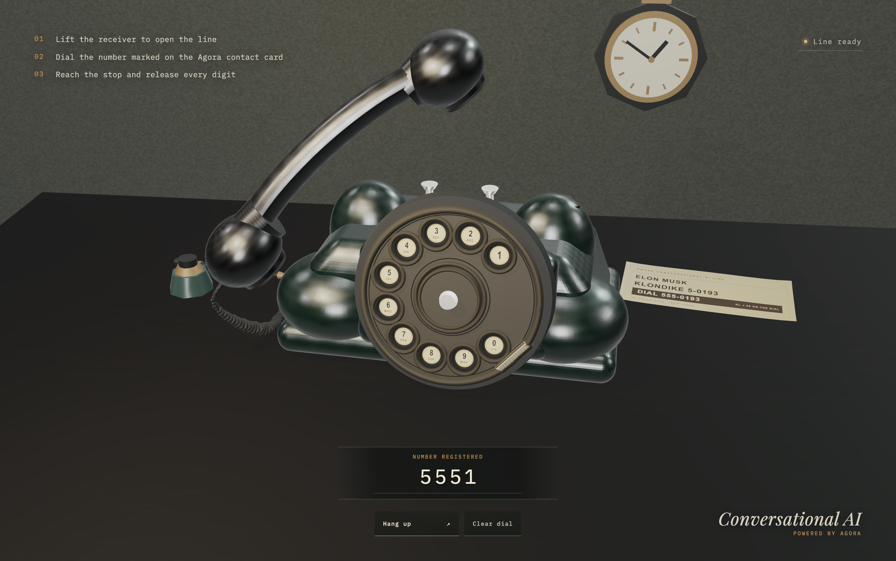

# Agora Rotary Dial Phone

An interactive rotary telephone built with Three.js and powered by Agora
Conversational AI.

[](LICENSE)
[](https://threejs.org/)
[](https://www.agora.io/en/products/conversational-ai-engine/)

**[Try the live demo →](https://rotary-dial-phone.vercel.app)**

[](https://rotary-dial-phone.vercel.app)

Lift the receiver, dial `555-0193`, and start a real-time Elon-inspired AI
conversation. Every digit must reach the metal stop before the dial returns and
registers it—just like a physical rotary phone.

## Highlights

- **Procedural 3D scene** — an Art Deco telephone, desk set, materials, and
  contact card rendered in Three.js.
- **Physical rotary dialing** — finger-hole interaction, metal-stop detection,
  return travel, pulse registration, and mechanical audio.
- **Real-time voice** — microphone and remote-agent audio over Agora RTC, with
  optional RTM-powered status updates.
- **Resilient call lifecycle** — signed call tickets, token renewal, authorized
  shutdown, timeout handling, and a shared cleanup path.
- **Responsive interaction** — desktop and mobile controls with explicit
  loading, permission, connection, and error states.

## How it works

1. Lift the receiver to open the line.
2. Drag each digit on the rotary dial to the metal stop and release it.
3. After `555-0193` is complete, the server creates a dedicated Agora channel
   and returns channel-bound credentials.
4. The Conversational AI agent joins the call and the five-minute timer starts.
5. Hanging up, leaving the page, timing out, or encountering an error releases
   the agent, RTC/RTM clients, microphone, receiver, and dial state.

## Quick start

### Prerequisites

- Node.js 22 or newer
- pnpm 11.6.0
- An [Agora](https://console.agora.io/) project with an App ID and App
  Certificate
- A [Fish Audio](https://fish.audio/) API key
- A browser with WebGL, Web Audio, and microphone support

### Run locally

```bash
git clone https://github.com/zicojiao/agora-rotary-dial-phone.git
cd agora-rotary-dial-phone
corepack enable
pnpm install
cp .env.example .env.local
pnpm dev
```

Configure `.env.local`, open [http://localhost:3000](http://localhost:3000),
lift the receiver, and dial `555-0193`.

> Microphone access requires HTTPS in production. Browsers allow it on
> `localhost` during development.

## Environment variables

| Variable | Scope | Required | Purpose |
| --- | --- | --- | --- |
| `NEXT_PUBLIC_AGORA_APP_ID` | Browser and server | Yes | Agora project App ID; public by design |
| `NEXT_AGORA_APP_CERTIFICATE` | Server only | Yes | Signs Agora RTC and RTM tokens |
| `NEXT_PUBLIC_AGENT_UID` | Browser and server | No | Agent RTC UID; defaults to `123456` |
| `FISH_AUDIO_API_KEY` | Server only | Yes | Authorizes Fish Audio TTS requests |
| `CALL_TICKET_SECRET` | Server only | Yes | Signs call and agent-stop tickets |

Generate a call-ticket secret with:

```bash
openssl rand -hex 32
```

Voice selection and the Fish Audio backend are configured in
[`lib/fishAudio.ts`](lib/fishAudio.ts).

## Project structure

| Path | Purpose |
| --- | --- |
| [`app/`](app/) | Next.js page shell and server-only call API routes |
| [`components/`](components/) | React call orchestration, RTC runtime, and status UI |
| [`src/`](src/) | Three.js scene, procedural phone, dial physics, audio, and browser events |
| [`lib/`](lib/) | Agora configuration, Fish Audio setup, and signed call tickets |
| [`spec/`](spec/) | Physics, lifecycle, security, microphone, and API contract checks |

## Verification

```bash
pnpm lint
pnpm typecheck
pnpm test
pnpm build
pnpm audit --prod
```

Tests use mocked call creation and do not start live Agora or Fish Audio
sessions.

## Deployment

Deploy the project to Vercel or any platform that supports Next.js, then add the
required environment variables.

For self-hosting, run `pnpm build` followed by `pnpm start`.

## License

Released under the [MIT License](LICENSE).
